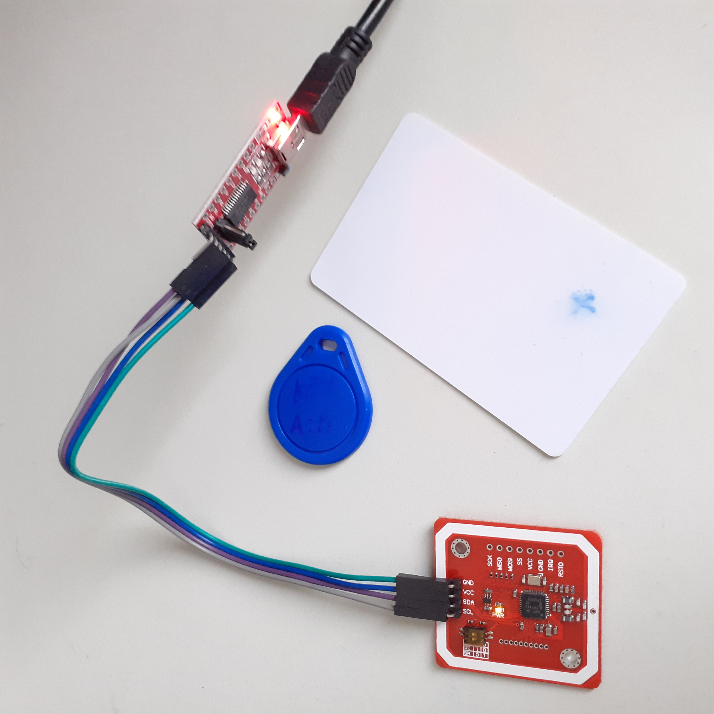
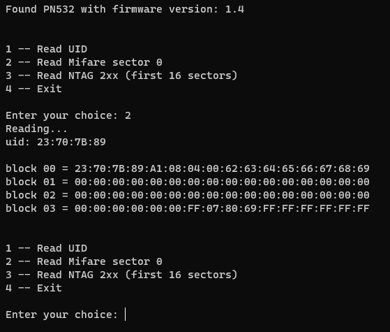

# PN532-UART

CPython PN532 NFC/RFID control library (UART)

Tested with clone Elechouse PN532 NFC RFID module V3 + FTDI USB/UART in Windows 11 and Linux.
Python 3.11




## Conections

| PN532 module | FTDI module     |
|--------------|-----------------|
| TX           | RX              |
| RX           | TX              |
| VCC          | VCC (5V or 3V3) |
| GND          | GND             |

**Set the dip switch to HSU (0, 0) on the NFC module.**

## Dependencies

```
pip install pyserial
```

## Test

```python
>>> import PN532_UART as NFC
>>> pn532 = NFC.PN532("/dev/ttyUSB0")  # replace COM port  (COM3 COM4 etc., on Windows)
>>> pn532.get_firmware_version()
(50, 1, 4, 7) # Reader found
```

## Usage

See example.py




